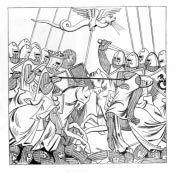
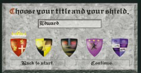

************
Introduction
************

Welcome to the Middle Ages! 

Part I of this manual is designed to help the first-time user get started 
playing and enjoying  LORDS OF THE REALM II.  

Windows 95 Installation
=======================

Step 1: Place the game CD in your CD-ROM drive. If the Windows 95 AutoPlay 
feature is enabled, a window will appear automatically on your screen. 
Select “Install LORDS OF THE REALM II” to begin the installation. Follow the 
onscreen instruction to complete the installation. 

Step 2: If your AutoPlay feature is not enabled, open the “My Computer” folder
on your desktop, and select the the drive letter that corresponds to your 
CD-ROM drive. From the window that appears, double click on the Setup icon. 
Follow the onscreen instructions to complete the installation. T
he install program will give you several options. For best performance, we 
recommend that you use the medium or maximum installations. To load the game 
any time after you have installed it, insert the CD into your CD-ROM drive. If 
your AutoPlay feature is enabled, the game will begin automatically; if not, 
click on your Start button and select LORDS II. You must have the game disc in 
your CD-ROM drive in order to play.
Part 1

MS-DOS Installation
===================

This game cannot be installed and run from Windows 3.1. If you have 
Windows 3.1, you must exit to DOS in order to install and play this game. 

Step 1: Exit to the MS-DOS prompt in order to install the game. The MS-DOS 
prompt should look something like this C:>or this C:\>( the letter may be 
different if you are using a different drive). You must exit completely out of 
any other programs you may have running, such as Windows or Dosshell. 

Step 2: Insert the CD into your CD-ROM drive. 

Step 3: Access your CD-ROM drive by typing in the letter designation of the 
drive, followed by a colon, and then pressing the <Enter> key. If your CDROM 
drive is your “D” drive, for example, type:
D: and then press <Enter>. At the drive prompt, type  
INSTALL and then press <Enter>. Follow the onscreen instructions. By default, 
the installation program will create a directory on your hard drive called 
LORDS2, and place all necessary game files in that directory. To load the game 
after you have installed it, access the directory that holds the game files by 
typing:
CD\LORDS2 and then pressing the <Enter> key. (If you have installed the game to
a different directory, access that one instead.) To run the game, type:
LORDS 2 and press <Enter>.

Getting Started
================
LORDS OF THE REALM II has an intuitive interface designed to allow you to begin
playing quickly and easily. After you install and load the game, we recommend
that you consult the LORDS II Getting Started card. This will familiarize you
with some of the game's basic concepts, and allow you to begin managing your 
first county. Do not expect to master the game right away. Use your first few 
games to experiment with different settings and strategies, and consult this 
manual or the game's on-line help when you have specific questions. The game 
includes several instruction screens that will appear automatically and will 
help you with the game's objectives and controls. When this manual or the 
on-line instructions tell you to “click on” something, click on it with the 
left mouse button unless specifically instructed to use the right mouse button. 
In general, left-clicking on an item performs an action or calls up a panel in 
which you can perform an action. Right-clicking on an item either calls up a 
panel that gives general information about the item, or exits a panel or screen 
without taking any action.

Help
====
If you have any questions, or if you come across something you do not 
understand, help is available in several forms. As you play, instructions will 
appear automatically on your screen. (You may turn these off by clicking on Tip 
Screens under the Game Help menu). There are also Tool Tips which explain many 
of the game's buttons and icons. These Tool Tips appear on the screen when you 
hold your mouse pointer over a button or feature for a moment. (You may turn 
the balloon help off by clicking on Tool Tips under the Game Help menu). For 
more detailed information, consult either this manual, or the on-line help. 
Online help is available under the Help menu.

Game Overview
=============

Setting Up a Game
=================

Once you load the game, the introduction will begin.
In the future, you may skip this sequence by clicking
your mouse.

When the introduction finishes, you will be prompted
to choose a single player or a multiple player game
(for 2 to 5 people). Click on the appropriate button
to continue.

If you choose Single Player, a second panel will
appear:

 * Select Play Now!! to begin a game straight away with the default game settings.
 * Select Load a Game to continue a previously saved single-player game. A list of saved games will appear. Choose one and continue.
 * Select Custom Game to set up a custom game. There are many variations to choose from (see Custom Games, page 109 for more details).
 * Select Back to Start to begin again.

Whenever you begin a game you will be prompted to enter your name and choose a 
shield that will be your coat of arms. The shield’s color will serve as your 
identifying color throughout the game. Enter your name in the box, and click on
a shield to select it.

Single Player Games
-------------------
When you play a single player game, you will compete against as many as four 
computer-controlled players: the Bishop, the Baron, the Knight, and the 
Countess. (For profiles on these characters, see the Diplomacy section of this
manual, beginning on page 96).

Multiple Player Games
---------------------
When you click on the Multiple players button, a Connection Method window will 
appear. This window lets you choose a modem or network connection to link 2 to 
5 human players.

Consult the Multiplayer Games section of this manual, page 110 for more 
information.

When you play a multiplayer game with fewer than 4 human players, you may 
decide how many computer controlled nobles (if any) you will also compete 
against.

Game Time and Interface
=======================

Game Time
---------
LORDS OF THE REALM II is both a turn-based and a real time game.

All county management aspects of the game take place in a turn-based 
environment. Each turn represents a season of the year, and as the game 
progresses, so will the years. All players will take their turns 
simultaneously.

As soon as any battle commences, however, the action begins to take place in 
real time. During a battle, you may issue orders while the fight rages, or you
may pause and resume the action as you wish. Both armies will be able to move 
and attack at any time while the battle is on (see Battles, page 78).

During each seasonal turn, you will tend to the essentials of building and 
managing your realm. There are five main types of action you may take during 
any turn:

#. **Manage your counties:** This means making sure your people are well fed
   and happy, dividing labor between food production and industry, monitoring
   your treasury funds, buying and selling goods at a visiting merchant's 
   wagon, sending supplies between your counties, and checking on the progress 
   of any castles you may be building.

#. **Create and dispatch armies:** This means drafting peasants from your 
   population, supplying them with whatever weapons you have purchased or 
   produced, and sending them off to conquer the counties of your opponents. 
   You may also hire mercenary armies whenever they are available, provided you
   can afford them.

#. **Build castles:** You should build some kind of a castle as soon as you 
   have enough stone and wood, and enough peasant workers to complete the task 
   in a reasonable amount of time. The number of turns it takes to build a 
   castle depends on the complexity and size of the design you have chosen, the
   number of castle builders you have assigned, and the availability of 
   materials.

#. **Engage in ground battles or sieges:** During any turn, your troops may 
   engage in a battle or castle siege. More than one battle may be fought in
   any single turn.
   
   An army can either fight a traditional battle on open ground, or, in an 
   effort to capture a castle, it can lay siege. During a siege, the attacking
   army surrounds an enemy castle and spends several seasons constructing siege
   weapons such as battering rams and catapults. When the weapons are ready, 
   the battle begins.

#. **Engage in Diplomacy:** Your relationships with the other would-be kings 
   will develop as the game progresses. You may exchange messages, establish 
   alliances, or foster hostile rivalries with your opponents.

#. **End your turn:** When your tasks are complete, click on the End Turn 
   button. When all players have ended their turns, merchants, supply wagons, 
   and rebels will move around the map, the screen will darken momentarily, and
   the next turn will begin. When the map reveals a new season and the words 
   End Turn reappear on the button, you may begin your next turn.

Interface
---------
You may perform most of the game's functions by clicking on icons, buttons, 
text, or arrows.

In general, left-clicking on icons on the main map performs a function, while 
right-clicking calls up information. You may right-click on features in any 
county to view some general information about them.

The control panel at the right of the game screen contains many buttons and 
other features that allow you to manage your counties or view information. Up 
and down arrows, where they appear, will allow you to set numerical values. 
Slider bars allow you to allocate people between two types of activity. Much of
the gameplay in LORDS II occurs as you interact with figures and features on a
map. On the main map, the terrain displayed is a partial view of a larger 
landscape. To move your view, you may scroll using your mouse pointer.

Scroll around a map by placing your mouse pointer just over any edge of your 
computer screen. You may scroll in any direction: north, south, east, west, or
diagonal in any direction, until you reach the edge of the game area.