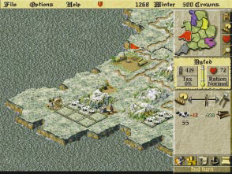
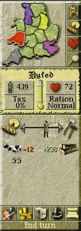
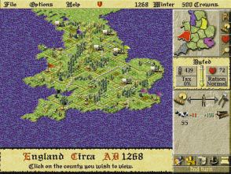

*********
The Realm 
*********

When the game begins, your screen will display a view of the realm and many of
its features. The country is divided up into independent counties. At the start
of the game each player controls a single county. County borders are marked by 
stone walls. Mountains, woods, and roads also appear on the main map.

At the start of the game, there are two types of counties: those controlled by
nobles, and those that are independent. Counties controlled by nobles appear in
the noble's color on the mini map in the upper right corner of the screen. In a
multiplayer game, a noble may represent either a human or a computer player.

The social center of each county is its county town. The county town will begin
as a small settlement with a colored flag indicating its noble (if it has one).
As its population grows, the town will fill up with buildings. You will be able
to get some sense of a county’s progress by looking at its county town. 

As a population grows, villages will also appear outside of the county town.

Each county also has several other features. Rightclicking on the features on 
the map will display information about them.  

Every county will have a blacksmith shop, several fields, and usually one or 
more industrial sites like lumber mills, quarries,  or iron mines. In custom 
games, you will be able to set many of the conditions of the starting counties. 

Your county and its resources will be the foundation upon which you will build 
your kingdom.

The Main Map
============

The main map is where most of the game action takes place. It shows a zoomed-in
view of the realm that displays the essential details of each county: towns, 
castles, industries, forests, mountains, fields, roads, borders. The main map 
shows only a portion of the entire realm. To move your view, scroll around by 
placing your mouse pointer just over any edge of your computer screen.

Your main map view will always determine the selected county. The control panel 
will always display information and control settings relevant to the selected
county. If you adjust the labor allocation slider bar, for example, you are 
managing labor for the selected county only.

The selected county is always the county in the center of your main map view. 
It is indicated on the mini map by a white highlight around its border. Watch 
the county selection change as you scroll around the realm.

The main map also shows merchant wagons and county-to-county transport wagons, 
as well as the armies of the various players. 

The control panel to the right of the main map is where you oversee and manage 
your counties and access other game screens. For more information on the panel,
see County Management (page 24).

The Control Panel
=================
The control panel allows you to view reports and take actions in order to rule
your lands.

The mini map in the upper corner shows the entire realm. Each county a player
controls is filled in with the player's game color. When you click on a county
in the mini map, the main map will center on that county.

The currently selected county the one in the center of the main map is 
indicated with a white border on the mini map.

The buttons to the right of the mini map display various color coded overlays
(idle workers, rations, and happiness) for each county your control. The bottom
button displays the overview map.

The Overview Map
================

The overview map is a full-screen view of the entire realm. To view the 
overview map, click on the button with the magnifying glass to the right of the
mini map.

The overview map shows the locations of all merchants, armies, supply wagons, 
castles, and revolting peasants. You may access it to watch enemy troop 
movements, find merchants, or locate mercenaries.

Click on a county on the overview map to display its information on the control
panel.

To return to the main map from the overview map, click on the overview map on 
the county you wish to view; or select the county you wish you view on the mini
map and click on the magnifying glass button.

The Menu Bar
============
In addition to your pull-down menus (File, Options, Help), the menu bar will 
always display the year and season, and the amount of money in your treasury. 
The unit of currency is the Crown.

At the beginning of every turn, a row of shields will appear along the menu 
bar. Each shield represents a player in the game (either human or 
computer-controlled). As each player ends his or her turn the corresponding
shield will disappear from the menu bar.

This feature comes in handy during multi-player modem or network games, as it 
allows everyone to see who has finished and who hasn't.

