#################
County Management
#################
Much of your time and effort will be devoted to managing your lands on the 
county level. You’ll find that each county has its own unique resources, 
features, and problems. If you can master county management, you will be well 
on your way to claiming the throne.

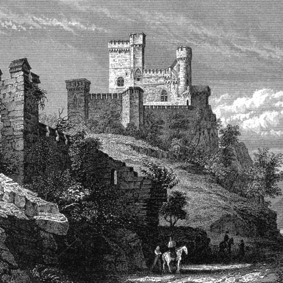

***********
Your People
***********
Each county has its own population, made up of peasants. (The terms "peasants",
"people", and "serfs" are used interchangeably in the game and manual.) Your 
population consists of everyone who is not serving in the military.

If you control more than one county, you control more than one population, and
each requires individual attention.

To manage successfully any population, you must keep its people happy. This
usually means keeping them healthy, which means feeding them well. All of this
requires you to manage with skill the county's labor pool in order to produce 
food and industrial goods.

At the start of the game, a good strategy is to strive for rapid population 
growth. Later on, a skilled ruler must learn to manipulate various factors in 
order to keep a county's population at just the right size.

Happiness
=========
A high happiness rating is a sign of a healthy population. A low happiness 
rating can lead to rioting, and, if left unaddressed, can even get you thrown 
out of a county!

The factors that can influence a county’s happiness are taxes, health, military
conscription, rations, and events.

*  **Taxes** are an essential part of government, and you will need tax money to 
   buy the things you need. Your people can live with a reasonable tax rate,
   but will become angry if taxes are too high (see Taxes, page 61). You may 
   have to experiment for some time before you can find a happy medium.

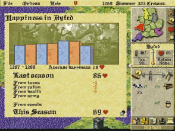

* **Health** is expressed as one of five levels: perfect, good, average, sick, and
  diseased. To see a selected county's health rating, click on the Rations 
  display on the control panel to display the Rations panel. A county's health
  is also shown on the health indicator on the control panel. The colored 
  portion of the indicator will be high when health is good, and low when it is
  poor.

  Health is determined by factors both within and beyond your control. Do your
  best to provide Normal rations of food (or more). Half and Quarter rations 
  are likely to cause health to deteriorate. Plague, an unfortunate random 
  occurrence, kills people and damages the county's health rating. You have no
  ability to prevent plague.

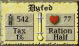

*  **Conscription**, like taxation, is necessary for the well-being of a 
   county. People will accept some conscription, but will not stand for a 
   leader who drafts too many of its young men into the military. The more men
   you conscript, the lower your happiness will drop.

   If Happiness drops to zero, you may not conscript any more men. Like taxes,
   you will have to experiment with any given county to determine its tolerance
   for conscription.

* **Rations** will also affect happiness. In addition to determining health 
  (which will influence happiness), rations will affect happiness in their own
  right. Low rations will reduce happiness while high rations will improve it.
  The rations panel will tell you the anticipated effect of the ration you set.

* **Events** can also influence happiness. The Events category on the happiness
  report refers to county takeovers, which cause severe reductions in 
  happiness, and revolts, which will damage happiness as long as they remain in
  a county.

To keep your population happy, feed it well and treat it fairly. Your county's
happiness rating, indicated by a number between 0 and 100, is located on the
control panel next to the red heart symbol. For a report on your county's
happiness, click directly on the happiness rating display on the control panel.

The Happiness Report charts the selected county's happiness rating by season. 
It also lists each factor that raises or lowers happiness, and the effect each
factor has had upon the rating since the previous season. If your happiness 
rating drops, this report will help you determine the cause.

*You can increase happiness* by:

* Providing normal, double or triple rations. The more food you give your
  people, the happier they get. (For information on rations and how they affect
  happiness see Food below.)

* Buying ale. As a special gift to your peasants, you may purchase ale from any
  travelling merchant. Ale's only role is to boost a county's happiness. Since
  you cannot produce ale yourself, it is a special treat for any population,
  although its effects are temporary. Buying ale for your people can be a nice
  gesture, and they will appreciate it!

*  Keeping taxes low.

*  Taking care not to draft too many peasants into military service.

:Tip: Keeping your people happy will lead to population growth. Happiness is
  measured on a rating scale that ranges from 0 to 100.

If your population has a high level of happiness, your population will grow.
Conversely, if your population is unhappy, it is likely to shrink (see
Population Growth, below).

An extremely unhappy population may revolt. Revolting peasants roam the
countryside and can seriously disrupt a county.

If you let a county's happiness rating fall too low for too long, your peasants
will revolt (you will get plenty of warning beforehand!). A revolt will remove
the county from your control, and produce a roving band of brigands, who will
wander the realm looking for food. A band of revolting brigands will appear on
the main map as a figure holding a torch.

Brigands will spread their dissent: happiness will drop in whatever counties 
they move into.

You may gain back a county that has revolted by recapturing its county town.

Population Growth
=================
The key to a thriving kingdom is a large citizenry. You should strive for large
populations in the counties you control. A large population means more tax 
income, greater armies, and a healthy industrial output. It also means greater
responsibility: the larger a population, the more food it demands from you.

A population's size fluctuates from season to season. Population growth will
come in the form of births and immigration.

* **Births:** Births will most likely occur each season. Sometimes a county 
  may experience a spontaneous baby boom. Human passions being what they are,
  such occurrences are unpredictable and beyond your control.

* **Immigration:** If your people are happy and healthy, word will get around and
  others will settle in your lands. Immigrants will move from counties whose 
  happiness is low to counties where it is high. The larger the difference in
  happiness between neighboring counties, the more people will move to the 
  happier county. Keeping your population happy usually means that immigrants 
  will come. A county's location will also affect immigration. A centrally 
  located county that borders many others is likely to attract more immigrants
  than a remote and isolated county.

* **Demobilization:** Whenever you disband an army, its soldiers will return 
  home to their county of origin. Their weapons will return to your treasury.

The following factors will cause a county's population to shrink:

*  **Deaths:** Death is a natural and unavoidable occurrence. Deaths will most 
   likely occur each season. You may attempt to minimize deaths by keeping 
   health high (i.e. providing normal or high rations). Sometimes factors 
   beyond your control, such as plague, will cause a rash of deaths.

* **Emigration:** If a population is unhappy, people will move out of a county
  to happier lands. If you set taxes too high, if you draft too many into the
  army, or if your rations are poor, emigration may soar.

* **Conscription:** Conscription influences population both directly and 
  indirectly. Indirectly, a high conscription rate can make people unhappy,
  which may cause them to emigrate. But conscription also has a more direct 
  effect on a county's population. Once someone is conscripted, he becomes a 
  soldier, and is no longer part of the population.

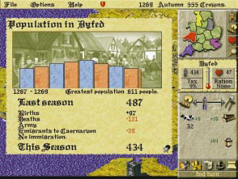

To monitor your fluctuating population, click directly on the population 
display on your control panel. The Population Report will appear, displaying a
graph that chronicles the seasonal changes in the selected county's population
since the start of the game.

In the beginning of the game, you will want your population to grow as fast as
possible. The bigger a county's population, the more workers it will have to 
build weapons and castles, which later on give you a decided edge in battles 
and sieges.

****
Food
****
You must do your best to provide enough food for each of your county 
populations. You should often check the rations panel for each county you
control, and make adjustments if necessary. Your people may eat *dairy produce,
beef, or grain*.

Feast or Famine?
----------------
Food management is done primarily through the rations panel. Click directly on
the ration display on the Control Panel to access the rations panel. Here you 
may set the amount of the county's ration to None, Quarter, Half, Normal, 
Double, or Triple. 

The Achieved listing shows the actual ration level the 
county's people are receiving. The Achieved ration will be lower than the 
Wanted ration if the county does not have enough food to supply the ration size
you have set.

The slider bar can also influence your achieved ration. If you have no grain,
for example, and your bar is all the way to the grain side, then your achieved
ration will be lower than it could be.

The heart symbols show the effect upon the county's happiness that the ration 
level will have over the next season. A ration of Normal or above will improve
happiness while half or quarter rations will decrease happiness. Likewise, 
average or better health will cause happiness to rise, while sickness and
disease will cause happiness to fall.

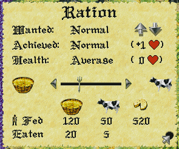

Milk, Beef, or Bread?
---------------------
If a county has cows, then its people will live, at least partially, on dairy
produce. People will automatically eat dairy as it is produced. 

Dairy produce cannot be sold or transported, and any extra dairy will spoil and
cannot be saved for future seasons.

On the Rations Panel, the number beneath the cheese symbol shows the number of
people that can survive solely on the county's dairy. As long as this is higher
than your population, you need not worry about the content of the county's 
diet.

As soon as dairy can no longer support an entire population, you will need to
supplement its diet with beef and/or grain. This is done through the slider bar
on the Rations Panel. The slider bar balances your population's diet --aside from
dairy-- between grain and beef.

At the bottom of the Rations panel, a simple chart lists grain, cattle and 
dairy produce. The first row shows how many people will be fed by each food 
item under the current settings. The second row shows how many sacks of grain,
or how many cows, will be eaten during that season under the current settings.
(There is no listing for Eaten under Dairy, because its consumption is 
automatic and it cannot be stored).

Moving the slider bar can affect this chart. Sliding the figure towards the 
grain sack, for example, will cause more sacks of grain to be eaten. Sliding
the figure toward the cow will cause more cows to be slaughtered for beef.

Notice how the amounts of cattle, grain and dairy produce eaten and the number
of people they feed are affected by setting the ration and moving the slider.

Transporting Food
-----------------
Grain and Cattle can be transported from county to county. If one county under
your rule has an abundance of food, while another is going hungry, you may send
a loaded transport wagon to share the wealth.

To send food between counties, select the *Send Supplies* button on your control
panel (see page 57 for more details).

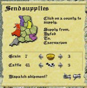

*****
Labor
*****
History's greatest kingdoms were built upon the sweat and toil of the common
laborer. A large, healthy, and well-managed work force is vital to securing and
expanding your realm.

There are two main categories of non-military labor to which you can assign
your peasants: agriculture and industry.

Agriculture consists of grain farming, cattle raising, and field reclamation.

Industry consists of woodcutting, stone quarrying, iron mining, weapon making
(the blacksmith) and castle building (and repair).

The Labor Allocation Slider Bar
===============================
The slider bar on the control panel allows you to divide your workers between
agriculture and industry. When the figure is directly in the center of the bar,
the labor force is divided exactly evenly. Click on the figure and drag it to
the right to assign more workers to industry, and to the left to assign more 
workers to agriculture.

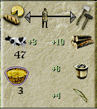

When you allocate laborers with the slider bar, their division between tasks is
automatic. New workers will be divided equally between operational tasks that 
need them, and tasks that do not need workers will not receive them.

Remember: workers will only go to operational tasks. Right-click on an industry
to check its status; leftclick on an industry to change its status.

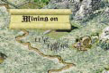

 Click directly on an inoperational iron mine to activate it.

*Click directly on an inoperational iron mine to activate it.*

If your county does not have an operational iron mine, for example, peasants 
assigned to industry will not work on iron mining. If you have no grain to 
plant, peasants assigned to agriculture do not work on grain farming.

Imagine, for example, that the only operational industrial sites a county has
are a lumber mill and an iron mine. This county's slider bar is set with the
figure right in the center, so that half the workers are assigned to industry
and half are assigned to agriculture. The half that are assigned to industry
will be divided equally among the operational lumber mill and iron mine, so 
that each will employ a quarter of the overall workforce.

The county's blacksmith will get no workers if it is not operational.

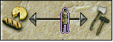

The Colors on the Control Panel
-------------------------------
When a blue outline appears around the figure on the slider bar, this indicates
that you have idle workers somewhere in your labor pool. If you have a large 
number of workers assigned to agriculture, for example, and only a few fields
are active, there will not be enough work for everyone to do. Your extra
workers will sit idle.

When you have idle workers, try adjusting the slider bar to make the blue
outline disappear. If the blue outline remains, you should consider activating
more industries or starting new cattle or grain fields. If you have idle
peasants, you might as well put them to work!

The production symbols below the slider bar will be outlined in red if there is
insufficient labor allocated to the corresponding task. If your cattle
production symbol has a red outline, for example, allocate more workers to
cattle farming.

If a production symbol is outlined in blue, on the other hand, this means that
too many workers are assigned to the corresponding task. If a county's 
blacksmith symbol has a blue outline, this means that there are more workers at
the blacksmith than needed. The extras are idle. When a red outline appears 
around a production symbol, allocate the extra workers to another task.

The Advanced Labor Panel
========================
When you adjust labor with the slider bar, the workers will take it upon
themselves to split up into each operational task.

You may accept the default labor allocation, or you may wish to take a more
hands-on management approach, and change it. If you have a castle under 
construction, for example, and you want to finish it quickly, you may take
workers from wood cutting and send them to the construction site to hasten the
castle project.

To do so, click directly on a county's county-town. This accesses the county's
labor panel. You never have to use this panel, but it is available to players 
who want a real hands-on management experience.

Each section of the labor panel represents a task. The figures within the task 
areas represent peasants at work.

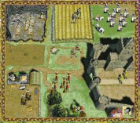

***********
Agriculture
***********
In LORDS II there are two types of agriculture: grain and cattle. You may buy
grain and cattle from travelling merchants (see Merchants, page 59).

When you have cows or grain you may either raise them or feed them directly to
your people. Increasing your agricultural output will allow you to feed a
growing population. You may also sell extra grain and
cows to merchants, which can be profitable.

Allocating agricultural labor is discussed in the Labor
section of this manual (see page 34). Feeding your
people is discussed on page 31.

Field Usage
===========
Grain and cattle are raised on a county’s fields. Fields vary in number from
county to county and can be allocated to different uses. Any field can be
assigned to any use, as long as it is not barren or damaged.

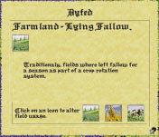

To assign a use to a field, click directly on the field. This brings up the
field usage panel. The symbol at the top of the panel indicates the current
status or usage of the selected field. The buttons along the bottom show all
possible field uses. Click on a button to assign a new usage.

Right click to exit without making a change. Be careful not to change 
accidentally an active grain field. If you do, your crops will be destroyed!

A field's use, or status, may be any one of the following:

*  **Fallow:** A fallow field is one that is fertile and can be allocated to grain
   or cattle farming. (With the Advanced Farming option activated, fallow
   fields are necessary to maintain fertility, see page 106).

*  **Barren:** A barren field is infertile and unsuitable for use. You will not be
   able to raise or plant anything on a barren field until you reclaim it and
   make it fallow. Field reclamation is hard work, and requires many peasants
   over several seasons.

*  **Grain:** Grain fields look different from season to season as grain is sown,
   grown and harvested. You will have no active grain fields at the beginning
   of a game. You must buy grain from a merchant, then allocate fallow fields
   to grain growing.

*  **Cattle:** A cattle field is a grassy meadow with cattle grazing on it. The
   appearance of cows on a field indicates that the field is currently assigned
   to cattle use. If a county has no cows, a field assigned to cattle will
   appear empty, but it will accommodate cows as soon as they are purchased or
   arrive by transport. The number of cows on a field reflects the field's
   crowding condition (see Cattle, page 42).

*  **Parched or Flooded:** Occasionally, a drought or a flood will damage a usable
   field. Such events are unfortunate and expensive, but unavoidable. You 
   cannot reclaim a weather-damaged field immediately, but after a single
   season its status will change to barren and you may set peasants to work to
   reclaim it.

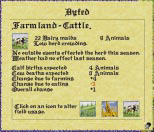

Reclaiming Barren Fields
------------------------
Barren fields are reclaimed over several seasons. To reclaim a barren field,
click on the field, and then select the farmer symbol from the panel that
appears. In order to reclaim a field, you must have at least one peasant 
assigned to field reclamation. For each field undergoing reclamation, a hoeing
figure will appear on your control panel. Click on the figure to see a report
on the field reclamation project. To speed the project up, assign more peasants
to reclamation duty (although you will never be able to reclaim more than a
quarter of a field in a single season). You will be able to watch as the field
is reclaimed gradually with the passing seasons.

Cattle 
======
You will begin each game with some cattle, which you will see grazing in your
county fields on the main map.

A cow figure on the main map does not represent a single cow, or even a
specific number of cows. Rather, it indicates that the field has been assigned
to cattle farming. As long as a county has at least one cow in its possession,
a cow figure will appear in each field that is assigned to cattle farming. If
the county has no cows, a field assigned to cattle farming will appear empty.

In addition, the number of cow figures in each field shows the overall herd
crowding conditions in that county. One cow figure represents low crowding,
two figures represent some crowding, and three represent overcrowding.
Overcrowding can harm the productivity of your herd—your cows need space to 
graze. Whenever you have overcrowding, allocate a new fallow field to cattle
farming if you can.

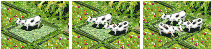

A county may do four things with its cows: it can raise them in its fields,
eating the dairy products they produce each season; it can slaughter and eat
them; it can transport them to other counties; or it can sell them to 
travelling merchants.

In order to raise cattle, a county must have at least one field assigned to 
cattle farming, some people working on cattle farming, and some cows.

Bovine Nutrition: Dairy and Beef
--------------------------------
Cattle provide two sources of food: dairy products and beef.

Dairy produce is a valuable food source. As long as a county has cows, they 
will produce cheese, milk, and other dairy products which will automatically
feed some, or all, of your people. Your population will only need to eat beef
or grain after the season's dairy produce has been consumed. If your dairy
output can feed your entire population, you need not worry about food 
allocation at all, because no grain or beef will be eaten (see Milk, Beef, or
Bead, page 32).

If you provide enough workers to tend to your cattle and do not slaughter and
eat too much of your herd, it will increase in size. The more cows you have,
the more dairy produce you will get.

But don't forget: as your herds grow, you may need more laborers and additional
cattle fields to accommodate them.

Whenever a county receives cattle or grain, remember to allocate a field or
fields for grazing or planting. Be sure to remember this when you transport
food from county to county!

Grain
=====
At the start of the game, your county will not have any grain. If you choose to
buy grain, you may either plant it or feed it directly to your peasants. In
order to grow grain, you must first buy it from a merchant. After buying the
grain, allocate at least one field to grain growing and save enough to plant in
the winter. Then assign workers to grain farming. Up to 5 sacks of grain can be
planted in one field, provided you have enough laborers. The more grain fields
you plant, the more workers you'll need to allocate to grain farming.

To raise grain:

*  Buy grain from a merchant.
*  In winter, assign one or more fields to grain (one field plants five sacks
   of grain).
*  Make sure you have laborers assigned to grain farming.

Grain will always be planted during the period between the winter and spring
turns, and it will always be harvested in the period between the fall and 
winter turns.

For each sack of grain you plant, you will harvest many more sacks, provided
you have adequate fields and labor. Grain can be an efficient food source and a
valuable commodity.

When the Advanced Farming option is turned on, grain will have different labor
demands in different seasons (see Advanced Farming, page 106).

The Grain Planting Cycle
------------------------
As long as you have done all of the above, grain will be planted at the
beginning of the following spring. You will see your active grain fields change
in appearance as the planting cycle progresses. 

Winter
^^^^^^
Winter is when you need to decide how many fields you want to assign to grain
for the coming year. Base this decision on how many sacks of grain you have (up
to five are planted per field), and how many grain laborers you have. Grain is
sown during the period between the winter and spring turns. Think of this
period as both the end of winter and the start of spring.

Spring
^^^^^^
In spring you will see that your fields have been sown. The grain is just
beginning to appear.

Summer
^^^^^^
In summer the grain continues to grow into full stalks.

Fall
^^^^
The fall is when your workers harvest the year's grain. Make sure you have
enough yarn workers to reap the maximum amount of grain. The grain you reap
will become available to you after you end your fall turn. The following winter
you should see the year's work yield a nice return.

Industry
========
The term *Industry* refers to: Wood Cutting, Stone Quarrying, Iron Mining, 
Blacksmith (weapon making), and Castle Building.

A county may not have the resources required for all industrial pursuits,
though. A county with no quarry, for example, may not produce stone.

You may activate or deactivate each industry in a county by clicking on it.
When you do so, a panel will appear, informing you whether you have switched
the industry on or off.

When you adjust labor with the slider bar, those you assign to industry will be
automatically divided between the industries you have activated in the county.

When an industry is active (or operational), its site will animate and a symbol
representing it will appear below the slider bar on your control panel. When an
industry is producing, a number will appear along with the icon, showing the
production that will occur over the following season. Click on any production 
symbol to access additional information about its industry.

Wood, stone, iron, and weapons may be used in any county regardless of where
they have been produced or purchased. You will never have to transport these 
items between counties.

Wood Cutting
============
Wood cutting takes place at a county’s lumber mill. When a lumber mill is
operational and has workers assigned to it, it will produce lumber.

When a selected county has an active lumber mill, a lumber symbol will appear
on the control panel. The number alongside it indicates the amount of wood that
will be produced over the next season under the current labor setting.

To see how much wood you have at any time, click on the treasury button. To
make any kind of weapon, or build any style of castle, you will need some
quantity of wood.

Stone Quarrying
===============
Stone can be produced in counties that have operational, staffed quarries. When
a selected county has an operational and productive quarry, the stone symbol on
the control panel shows the number of tonnes of stone that will be produced
over the next season.

The only use for stone (besides selling it to merchants) is in castle building.
All castle designs require some quantity of stone.

To see how much stone you have at any time, click on the treasury button.

Iron Mining
===========
Iron can be produced in any county that has an iron mine. When a selected
county has an operational and productive mine, the iron symbol in the control
panel will show the number of tonnes of iron that will be produced next season
under the current labor setting.

Iron is used by the blacksmith to produce weapons. All weapons, except the bow,
require some quantity of iron.

Blacksmith (weapon making)
==========================
Every county on the map will have a blacksmith shop where weapons may be
produced. An operational, staffed blacksmith will produce the weapon of your 
choice. Each county may only produce one type of weapon at a time.

The output of the blacksmith shop will depend upon the number of laborers
working there and the materials (wood and iron) available to them. When a
blacksmith shop is operational and staffed, the symbol that appears on the
control panel shows the weapon being produced, as well as how many will be
produced over the next season under the current labor setting.

To go the blacksmith shop, click directly on the weapon symbol on the control
panel (or click on the blacksmith on the advanced labor panel).

In the blacksmith shop, you will see a number of weapons hanging on or leaning
against the walls. The currently produced weapon lies on the table in the 
foreground.

To change the weapon being produced, find the weapon on the wall and click on
it. The new weapon will appear on the table in the foreground.

The panel at the bottom of the screen tells you how many blacksmiths are
working and how many of the selected weapon they will produce next season.

There is also a small box showing how much wood and/or iron is required to
produce a single one of the selected weapon. You will only be able to produce
as many weapons as you have materials for.

Once you have the required materials to make the weapon, you must make sure you
have laborers employed at the blacksmith.

As long as your blacksmith shop has the required materials and sufficient
laborers, it will produce the selected weapon each season.

You may choose a weapon for which you do not have the required amounts of wood
and/or iron. Your workers will begin producing it as soon as you collect these
materials.

***************
Castle Building
***************
Castle building (and alteration) works much like weapon production: you must
select a project, obtain the required materials, and assign a construction
staff.

For more detailed information about castles, read on...

In an age of violent conquest, nothing can ensure a county's protection like a
strong and imposing castle. As Edward I learned, a castle provides not only a
powerful stronghold against armed enemies, it also stands as a symbol of a
leader's authority and might. Each county may have only one castle at a time,
but there are several types of castles, ranging from a modest Wooden Palisade
to an opulent and foreboding Royal Castle.

To build a castle you must decide on a design, acquire the needed materials,
and then assign laborers to the task. It may take many seasons to complete a
castle.

Getting Materials
=================
Castles are built from wood and stone. You can buy these materials from a
merchant, or you may produce them yourself (if your county has the resources).
If you control more than one county, the materials they produce will be shared.
(For information about wood and stone production, see Industry, page 46.)

When you choose a castle design (see below), you will see how many units of
stone and wood the design demands.

You may begin the construction before you have all the required wood and stone.
As you collect these materials, they will automatically be sent to the castle
site until the required amounts have been used. (Wood will be shared with
blacksmiths if you are also producing weapons.)

Choosing a Castle Design
========================
When you're ready to build a new castle in a county, make sure the county is
selected, click on the Build Castle button on your control panel.

Note: If the selected county already has a castle, you may only alter the
existing castle—you may not build a second one.

This brings you to the castle design screen. Pictured
at the bottom of the screen, from the simplest at left
to the most complex at right, are the five castle
designs in the game:

*  Wooden Palisade
*  Motte and Bailey
*  Norman Keep
*  Stone Castle
*  Royal Castle

Choose the design you want by clicking on one of the castles pictured. One good
strategy is to start with a simple design and improve upon it as resources
become available. If you put off building a castle until you have enough
workers and materials for a complex design, your county will be without a
castle for years, and thus vulnerable to attack.

The scroll at the top right names the castle design you have selected. It also
shows how many units of stone and/or wood are needed to build it.

Beneath the materials listing is an entry describing how long it will take to
build the selected design. If you have any laborers assigned to castle
building, this display will show you how long it will take that number of
laborers to complete the construction. If you have no laborers assigned to
castle building, this display shows the completion time based on a minimum
recommended number of workers.

Once you have chosen a design, click on the thumbs up gauntlet to begin the
project and return to the main map. There you will see the castle under
construction in your county.

While construction is going on, the control panel will display a castle symbol.
The accompanying number indicates how many seasons remain until the castle is
complete under the current labor setting.

Right-click on the castle itself for a report on how many builders are at work,
how many seasons the project has to go, and how many tonnes of wood and stone
(if any) the builders still need. To speed the construction of a castle, 
allocate more workers to the construction project.

At the beginning of your turn following completion of the castle, you will
receive a message that a castle has been built in your county.

Assigning Castle Builders
=========================
As soon as you approve a castle design, a portion of the peasants assigned to
industry will automatically begin working on castle building. If you have too
few builders to complete the castle within a reasonable amount of time, you may
take some peasants away from other industries and assign them to castle
building (see page 37).

Remember to maintain a balance in your labor force. Don't, for instance, assign
all your woodcutters to castle building if you still need wood to build the
castle. Once the castle is complete, the castle builders will automatically be
distributed among the county's other operational industries; or, if all the
other industries are fully staffed, they will become idle townsfolk.

Altering a Castle
=================
You may alter a castle in any county by upgrading or downgrading it. To alter
the castle of a selected county, click on the Build Castle button on your
control panel to access the castle design screen. Select a new castle design.

Upgrading a castle will require labor, materials and time. Downgrading a castle
will also require labor and time. Depending on the previous castle design, a
downgrade may free up some materials, or it may require other additional 
materials. Going from a Norman Keep, for example, to a Motte and Bailey, will
require wood, but will yield extra stone when the project is finished.

The Garrison
============
A garrison is an army that resides in and defends a castle. A new castle will
automatically include a garrison. Its size will vary according to the size of
the castle, its soldiers are subtracted from the county population, and its
weapon costs are covered by the cost of the castle.

Archers are good at defending castle walls, but you may want to supplement the
automatic garrison with some hand-to-hand units like pikemen and swordsmen.
In case of a breach, you will need someone to take on the invaders at close
range.

The capacity of each castle varies with its size: a Wooden Palisade can hold
far fewer men, for example, than a Royal Castle. Right-click on a completed
castle to display its troop capacity.

To garrison a castle, march an army right into the castle. While a castle is
garrisoned, a flag of the player's color will fly over it. To review the
garrison, rightclick directly on the castle.

You are not required to garrison the castle with the largest army it can hold.
If one of your opponents is preparing to lay siege, however, you might want to
fill it to capacity.

The best type of soldiers to place in a castle are archers and crossbowmen.
Shooting arrows from high atop castle walls, these units are very effective
against attackers.

Repairing a Castle
==================
Castles will commonly need repair after a siege. After you win a castle by
siege, it will be yours to repair. Remember this as you crash through walls and
gates!

If you fail to repair a castle, its damage will remain and may allow the castle
to be easily breached in the next siege.

Right click on a castle to see its information panel. If the castle needs 
repair, this panel will tell you what materials are required, and will estimate
how long it will take a crew to complete the job. 

As soon as you have the required materials and have allocated laborer, the 
repairs will begin. To repair a castle, allocate laborers to castle building
just as you would for a new castle project.

While a castle repair is underway, a castle symbol will appear on your control
panel accompanied by the number of seasons it will take the current crew to
finish the repair. The more workers you assign to the job, the faster it will
be completed.

Note: Castle repairs will not happen in stages. Only when the repair is 100
percent finished will you see any improvement.

**************************
Managing Multiple Counties
**************************
Your goal in LORDS OF THE REALM II is to conquer all of your opponents so that
your rule is uncontested. To do this, you must capture multiple counties and
bring them under your rule.

Each new county will present a new challenge to your administrative skills.
The more counties you conquer, the more counties you must manage. Some of your
counties may thrive, while others may founder.

Recently conquered populations will often require special attention. After all,
you have just seized their county by defeating their soldiers on the
battlefield. They can be forgiven for mistrusting you. Your challenge is to
convince them that your conquest is for their own good!

The overview map at the top of the control panel allows you to move easily from
one to another. The counties you control will be shown in your color.

Your counties share a common supply of gold, wood, iron, stone and weapons.
Once any quantity of these items is produced or acquired by one county, it is
automatically accessible to all others in your realm. Click on the Treasury
button to check your stores of all these items.

Food, on the other hand, is always grown, produced, or purchased in a specific
county. You may send grain or cattle from one county to another with the Send
Supplies button. Otherwise, food will always remain in the county of its
purchase or production.

The counties you control must be contiguous, i.e. they must all be contained
within a common border. If your realm is split into two non-connected bodies,
you will immediately lose the weaker one! In the game's advanced stages, this
becomes a key strategic element. If you can divide an opponent's realm by
seizing a single county, you will deal a serious blow.

Transporting Goods
------------------
The only goods you may transport from one county to another are grain and cows.
To transport goods from one county to another, click on the Send Supplies 
button at the bottom of the control panel. The transport panel will appear.

The origin of the shipment will always be the county that is selected at the
time you open the transport panel. The transport panel displays a small map of
the kingdom, with the county of origin highlighted.

Select the county to receive the goods by clicking on it on the small kingdom
map. You may only send goods to counties you control. The receiving county's
name will appear on the transport panel.

Use the right and left arrows to set the quantity of grain and/or cows you
would like to send. (Dairy products cannot be transported due to their tendency
to spoil.) To dispatch the shipment, click on the thumbs up gauntlet.

The shipment will take a few seasons, depending on the distance it must travel,
to reach its destination.

Consider your transport's path and the locations of enemy armies. Supply carts
can be destroyed!

***********
The Economy
***********
Your ultimate goal to eliminate all rival claimants to the throne—can only be
accomplished with large, powerful armies. To support such armies, you will
need to cultivate a strong economy based on trade, taxes, agriculture, and
industry.

The Treasury
============
The treasury lists the TOTAL amount of gold, iron, stone, wood and weaponry for
ALL of your counties. To view the treasury, click on the Treasury button on
the control panel. No matter how many counties you control, they all share one
treasury and all the items in it. When one of your counties produces or buys
stone, for example, the stone immediately becomes available to all the other
counties in your realm.

Be sure to keep a close eye on how much gold your treasury contains. You must
spend within your means. Consult the treasury before beginning a castle
construction to see how much wood and stone you have, or before raising an army
to see what types of weaponry you have. The treasury panel also includes the
button that accesses the Best Noble report.

Merchants
=========
Trade may be conducted only when a merchant is present in a county. Merchant
wagons are always visible on the main map. Merchants will generally travel from
county to county on a set course. The frequency of their visits can vary from
county to county a centrally located county may host a visiting merchant almost
every season, while a remote county will receive infrequent visits. As the
seasons progress, you will get to know the routes of the various merchants,
and this will help you plan ahead.

When a county does not have enough food, resources or weapons, you may buy 
these items from a merchant. You may also sell these items to a merchant if
you have extra, or need to raise money.

To go to the marketplace, click on a merchant wagon in any county you control.

When you rest the mouse pointer on the items in the marketplace screen, a small
scroll will appear, naming the item and showing two numbers (such as 30/60).
The left number is the selling price, in crowns, of the item, or the amount you
will get if you sell a unit of that item to the merchant.

The right number is the buying price the amount you will pay for each unit of
the item that you buy from the merchant. Most merchants are tough businessmen,
and you'll notice a large difference between buying and selling prices!

To buy or sell an item, click on it on the marketplace screen. A panel will
appear, with up and down arrows that allow you to buy and sell goods. The right
set of arrows sets the maximum possible purchase or sale, while the left set
allows you to change the quantity one unit at a time.

The panel also tells you the unit price of the selected item, how many crowns
your treasury has, and your gain or loss as a result of the transaction.

Click on the up arrow to buy, or click on the down arrow to sell.

Select the thumbs up gauntlet to complete the transaction. Select the thumbs
down gauntlet (or right click) to exit the panel without making a transaction.

Taxes
=====

Taxes are a dual edged sword for any ruler. On one hand, they fill your coffers
with much-needed gold to fund castle construction, army building, and other
essentials. On the other hand, if you raise taxes too high your people will
object. Their happiness rating will drop, and they may ultimately overthrow
your rule (see Happiness, page 25).

The tax rate of the selected county is displayed on the control panel beneath
the population tally. Each county can have a different tax rate but all taxes
go into your single central treasury.

Click on the tax
rate to access
the tax panel.

A county's tax rate is expressed as a percentage of each person's income that
is handed over to your government each season. The size of a population,
combined with the tax rate, determines your seasonal tax revenues.

To adjust a county's tax rate, click directly on the tax rate display on the
control panel. The tax panel will appear. Click on the up or down arrows to raise or
lower the tax rate. Notice how happiness goes up as taxes go down (and vice 
versa). The number next to the words “People Pay” is the number of crowns that
you will collect from that county in the next season, based on the rate that is
currently set. Note that taxes are collected at the end of the season,
prior to any population changes that will appear when
the next season begins. So, the People Pay number will
be accurate.

There will be some communication between all of your counties, so if you set
taxes outrageously high in one county, this will damage the happiness ratings
of all your other counties. The tax panel for each county will display the
effect of that counties tax rate (if any) on all your other counties. The
condition of a county should help you determine its tax rate. If your 
population is very unhappy, you may want to avoid taxing it at all. Revolts can
be costly!

If your population is happy, perhaps you can afford to set very high taxes, as
long as you don't do too much damage to its state of general merriment. When a
county's happiness rating hits zero, you can not increase its tax rate at all.

Castles and Tax Revenues
------------------------
Whether or not a county has a castle—and the size of the castle if it does have
one will also affect your tax revenues. Castles attract wealth, so a county
with a castle will have greater wealth than one without one. Therefore when you
build a new castle in a county, your tax revenues will increase, even if the
tax rate you set remains the same.

Likewise, improving an existing castle will further boost your tax revenues,
while downgrading a castle will cause tax revenues to fall.

Winning the Game
----------------
To win the game, you must completely eliminate every other noble who is vying
for the crown. This includes both human and computer controlled nobles. Victory
in LORDS II requires complete annihilation of all who challenge your rule. As
long as any competitor still has a single county or army in possession, your
victory is incomplete.

You may check your status relative to the other players in several categories
by consulting the Best Noble report. This report compares each player's status
with regard to: number of counties, number of castles, number of troops, number
of gold crowns, happiest people, number of people, and an overall rating,
greatest noble, which takes all these factors into consideration.

Access the Best Noble report through the treasury panel.
